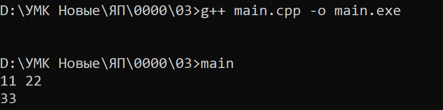

# Языки программирования
## Лабораторная работа 1
### Задание 1 **(4)**
*Составьте глоссарий из определений лекции. Проверка отчета будет включать 
проверку знания определений*
* **Исходный код.** Текст программы на языке программирования
* **Объектный код.**
* **Исполняемый код.**
* ...

### Задание 2 **(1)**
*Установите файловый менеджер* **Far Manager**. *Официальный сайт*

<https://farmanager.com/download.php?l=ru>.

*Изучите его основные возможности по работе с файлами: копирование, переименование, удаление, 
запуск, редактирование, просмотр, создание файлов и папок, использование командной строки. 
Потренеруйтесь в их использовании. Для проверки вам будет дано задание на работу с файлами
с ограничением на время выполнения. Обратите внимание, что все задания требуется выполнить 
на клавиатуре без использования мыши.*

*В отчет запишите справку по горячим клавишам Far Manager, которые вы использовали.*

* **Alt+F1** Выбор диска на левой панели
* ...

### Задание 3 **(1)**
*Установите компилятор* **GNU C++** в составе среды программирования **code::blocks**.

*Официальный сайт*

<https://www.codeblocks.org/downloads/binaries> 

*Обратите внимание, что вам нужна сборка, в состав которой входит* **mingw**, *например*, **codeblocks-25.03mingw-setup.exe**.

*Найдите папку с бинарными файлами, в которой хранится компилятор С++ (файл* **g++.exe**).
*Например, она может называться* **D:\Program Files (x86)\CodeBlocks\MinGW\bin**.

*Проверьте, что эта папка указана в настройках путей Windows. Пункт настроек:* 

**Изменение переменных среды текущего пользователя**. 

*В переменной* **path** *должен быть указан путь к папке с компилятором С++.*

*Используя файловый менеджер создайте папку с проектом на С++, в нем запишите программу для сложения
двух чисел, выполните ее трансляцию из командной строки, запустите и убедитесь в ее работоспособности.
При проверке эту часть задания потребуется выполнить за две минуты без использования мыши.*

*В отчет вставьте скриншот с трансляцией программы из командной строки и ее запуском и работой.*

Пример 



### Задание 4. **(2)**

*В этом задании необходимо записать на С++ программу, состоящую из четырех модулей. Первый модуль 
должен содержать функцию* **message(std::string)** *для вывода произвольного сообщения на консоль.*

```
#include <string>
void message(std::string mes) {
    std::cout << mes << std::endl;
}
```
*Второй модуль должен содержать функцию* **hello()** *для вывода сообщения* **hello world!!!** *и использовать
функцию* **message**.

*Третий модуль аналогично второму должен содержать должен содержать функцию* **goodbye()** *для вывода сообщения* **goodbye world!!!**.

*Четвертый модуль должен содержать функцию* **main** *и вызывать функции* **hello** *и* **goodbye**.

* Допишите заголовочные файлы.
* Создайте объектные файлы для каждой из единиц трансляции. Каждый файл надо получить отдельной командой.
* Выполните сборку программы из объектных файлов и проверьте ее работоспособность.
* Проверьте, можно ли выполнить компиляцию одного файла, если другой содержит синтаксическую ошибку.
* Проверьте, что произойдет при сборке, если один из объектных файлов будет потерян.

*В отчет вставьте скриншоты работы в командной строке и пояснения к заданиям*

*Все файлы с исходными кодами надо сохранить в папке 04*

# Задание 5 **(2)**
*Выполните задание аналогичное предыдущему на языке Java. Программа должна содержать четыре класса в четырех файлах.*

# Задание 6 **(2)**
*Выполните задание аналогичное предыдущему на языке python. Программа должна содержать четыре функции в четырех файлах.*

*Далее записаны функции в двух файлах. Инструкция* **import** *импортирует функцию из другого модуля.*

**message.py**
```
def message(mes):
   print(mes)
```
**hello.py**
```
from message import message
def hello():
   message('Hello world!!!')


