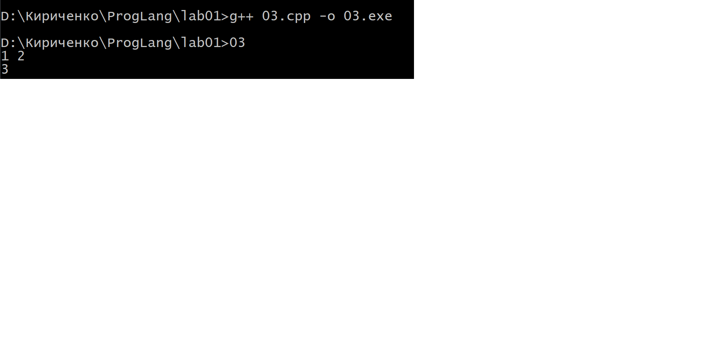

# Отчет по работе 1

### Задание 1
* Исходный код - Текст программы на языке программирования
* Объектны код
* Исполняемый код
* Трансляция
* Компилятор
* Интерпретатор

### Задание 2
* ALT+F1 Выбор диска на левой панели
* SHIFT+F4 Создание файла
...

### Задание 3

### Задание 4
